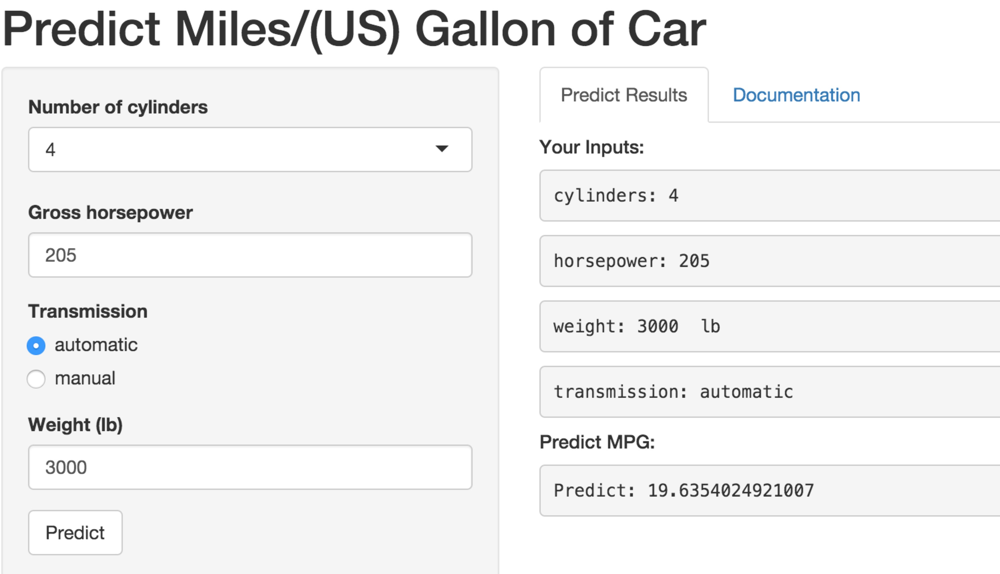

## Introduction
Reproducible pitch presentation for the shiny application of peer assessments in Developing Data Products course.

1. 5 slides to pitch our idea done in Slidify or Rstudio Presenter
2. Your presentation pushed to github or Rpubs
3. A link to your github or Rpubs presentation pasted into the text box below

The shiny application is to predict miles per gallon of cars.
Shiny Application URL:
https://zoyanhui.shinyapps.io/DevelopingDataProducts-shiny-application

--- .class #id 

## Dataset for predict
The application is predict by a linear model, which is fitted by the mtcars dataset from library dataset of R.

```{r, echo=FALSE}
library(datasets)
data("mtcars")
```   

```{r}
head(mtcars)
```

--- .class #id   

## Predict Shiny App


--- 

## Use Guide
After linear regression, the best linear model shows mpg is related to cyl, hp, wt and am.

So, while using the application, something need be entered:
- cyl: Number of cylinders, which is 4,6 or 8
- hp: 	Gross horsepower
- wt: 	Weight (lb), use lb as the unit not lb/1000
- am:   Transmission (0 = automatic, 1 = manual)

After enter these data, click the predict button to see the result.


